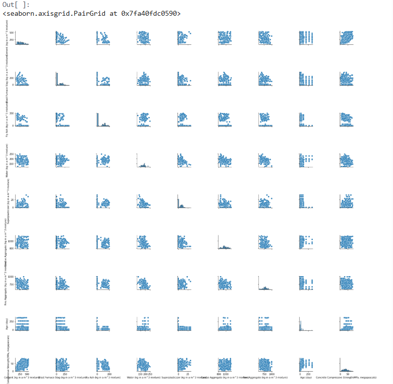

# 🧱 Cement Strength Prediction

This project was developed during my internship to build a **regression model** that predicts the **compressive strength of cement** based on its chemical and physical properties. It uses machine learning techniques to help improve material quality and decision-making in the construction industry.

---

## 📊 Dataset Overview

The dataset includes:
- Cement (component 1)
- Blast Furnace Slag (component 2)
- Fly Ash (component 3)
- Water
- Superplasticizer
- Coarse Aggregate
- Fine Aggregate
- Age (days)
- Compressive Strength (target)

---

## 📈 Model

- **Algorithm**: Linear Regression (scikit-learn)
- **Evaluation Metrics**:
  - R² Score: ~0.92
  - Mean Squared Error (MSE): ~3.5

You can view the complete workflow in the notebook:
📂 `Regression_Model_to_Predict_Cement_Compressive_Strength_Project.ipynb`

---

## 🧰 Tools Used

- Python
- Jupyter Notebook
- Scikit-learn
- Pandas, NumPy, Matplotlib, Seaborn

---

## 🖼️ Sample Output





---

## 📁 Folder Contents

```bash
📁 cement-strength-prediction
│
├── Regression_Model_to_Predict_Cement_Compressive_Strength_Project.ipynb
├── README.md
```

## 📬 Contact

**Zakir Elaskar**  
📧 [zelaskar@csuchico.edu](mailto:zelaskar@csuchico.edu) | [elaskarzakir@gmail.com](mailto:elaskarzakir@gmail.com)  
🔗 [LinkedIn](https://www.linkedin.com/in/zakelaskar)
